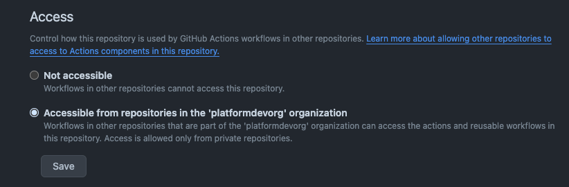

# Reusable Workflows 

Contains reusable workflows that can be shared to the organization or other repositories to consume. 

This repository must be shared to other repositories using the following Actions setting for this repository. 

## Example Usage

